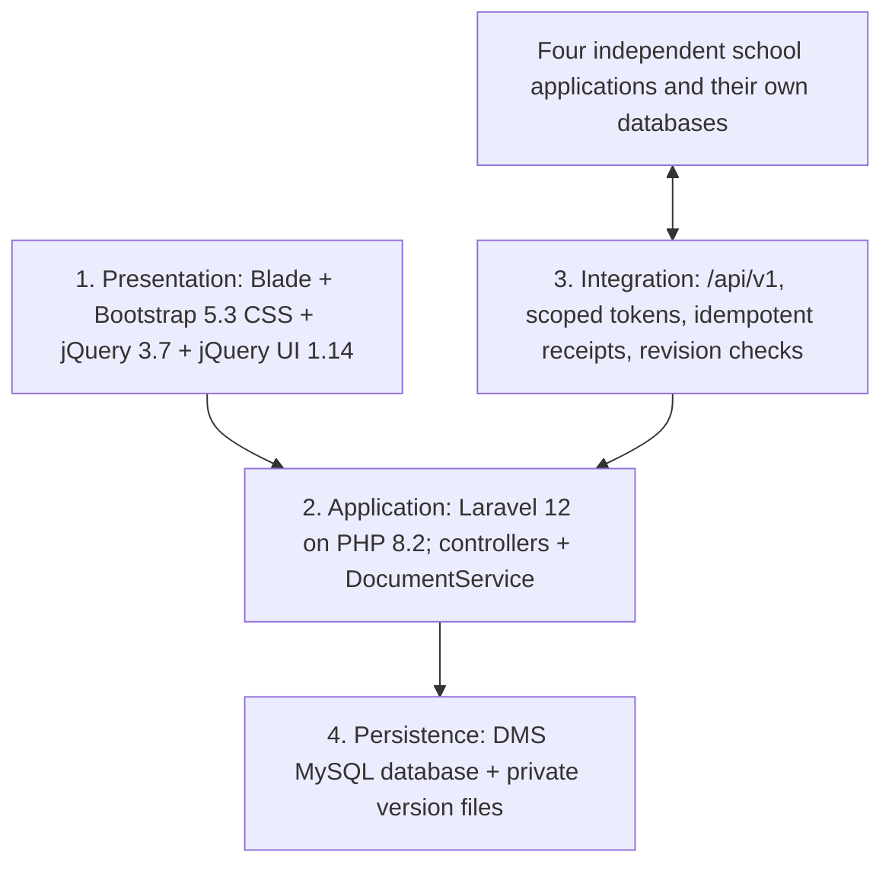

# School Document Management System architecture

Current reference, 9 October 2026. Institution-neutral. This document and WORKFLOW-OWNERSHIP.md supersede contradictory descriptions in the original backlog. The diagram ARCHITECTURE.drawio is editable in diagrams.net; TECH-STACK-CURRENT.csv lists the current stack.

## Purpose and boundaries

DMS independently stores documents, immutable versions, user-defined business history and current source snapshots. It organizes files like Drive without deciding whether a student, employee, application or payroll transaction is approved. Business decisions belong to originating systems and users' processes. Malware scanning and file-integrity checks are security controls, not business verification.

Five groups own five operational databases: Employee Management, Online Admission, DMS, Enrollment and Payroll. DMS owns its MySQL database and private file storage. The central history repository is part of the DMS database, not a sixth shared database. Other groups never write directly to it. Initial copies and later revisions arrive through authenticated APIs; no automatic full import exists until source contracts/adapters are available.

## Four logical tiers

These are logical responsibilities inside one deployable Laravel application. They are not four servers or microservices. The code currently follows Laravel MVC with a shared document service; DriveController and HistoryController also perform transactional persistence. It is not presented as a completed Clean Architecture implementation with fully isolated domain/repository layers.

## Implemented components

| Component | Responsibility |
|---|---|
| Blade views / public assets | Home suggestions, file grid/list, folder navigation, action dialogs, history screen, sign-in and modal scroll lock |
| DocumentController / DocumentService | Intake, permission scopes, validation, scanner execution, immutable versions, metadata, checksum downloads, audit and document events |
| DriveController | Folders, rename/move, personal stars, recoverable Trash, private previews and named expiring shares |
| HistoryController | Source snapshots, immutable received events, revision ordering, duplicate/conflict handling and scoped history reads |
| IntegrationAuth | Hashed bearer-token lookup; binds source, school and campus to the request |
| Eloquent User model | Authentication and user identity; other existing persistence uses Laravel's database query builder and transactions |
| Artisan commands | Connector issuance and pending/failed malware-scan retry |

Eloquent and the query builder share Laravel's configured MySQL connection. All writes are not currently Eloquent model operations; no additional ORM or backend framework is introduced. Bootstrap supplies CSS only so its JavaScript plugins do not compete with jQuery UI.

## Data and ownership

| Tables | Owns |
|---|---|
| users, sessions | Local identity and sessions; SSO remains pending |
| documents, document_versions | Metadata, source reference, revision, folder, Trash state and immutable file-version evidence |
| folders, document_stars, document_shares | Scoped organization, personal stars, named/version-specific expiring grants |
| source_records | Latest accepted complete snapshot per school/campus/source/type/external record |
| source_history | Received revisions including older deliveries and deletion events |
| audit_entries | Application append-only activity history; not an externally tamper-proof ledger |
| integration_accounts, idempotency_requests, integration_events | Connector scopes, replay receipts and ordered outgoing document events |
| cache, jobs and associated framework tables | Configured Laravel cache/queue storage; not proof of scheduled connector jobs |

Bytes are stored under `storage/app/private/documents/<version UUID>`. The database stores paths, checksums and metadata, not file BLOBs. Files must not be exposed through a public storage symlink. MySQL backups and private-file backups must be recovered consistently, including required configuration/keys.

## Main flows

**Upload:** authenticate → validate source/category/actual content → preserve version privately → run configured malware scanner → commit metadata/audit/event → return receipt. Without successful scanning the file is blocked. A clean file is Available without review. Replacement uses a revision check and retains previous versions.

**History:** authenticate source token → validate event → identify scoped source record → transaction and record lock/compare-and-set → preserve receipt → update snapshot only for a newer revision → audit → acknowledge. Unique constraints reject competing revision/event identities. Retry conflicts with the same event ID. A source deletion becomes a tombstone and does not purge historical evidence.

**Download/share:** authenticate active user → recheck school/campus/source → enforce live version/grant and clean scan → verify checksum → audit → return private no-store response. Shares do not expand recipient permissions. Trash blocks active retrieval and remains restorable.

**Source onboarding:** agree identifiers/allowed fields and versions → consistent initial snapshot/change cursor → deliver complete snapshots → source-side outbox/retries → reconcile missing revisions. Outboxes in the other groups' databases and pull adapters are their coordinated integration work, not implemented DMS features.

## Stack and deployment

PHP 8.2, Laravel 12, Eloquent/Blade, Bootstrap 5.3, jQuery 3.7, jQuery UI 1.14, MySQL with transactional InnoDB tables. No React, Vue, Node runtime or npm build is required. Serve only `public/` behind HTTPS; PHP's development server is local preview only. Private filesystem storage and ClamAV are supporting infrastructure.

`.env.example` and the application fallback use MySQL. `phpunit.xml` uses isolated SQLite in memory for fast regressions; `phpunit.mysql.xml` and the GitHub workflow exercise MySQL separately. SQLite tests do not establish MySQL contention behavior. The existing ignored local demo may remain explicitly configured for SQLite until a real MySQL server and migration/export are provisioned; no legacy data is silently discarded.

## Verification and remaining production work

The local XAMPP database binaries are MariaDB 10.4, and no database server was reachable during this update. They are not reported as MySQL. MySQL CI uses an isolated test database, never the demo or a production database. Check its result before claiming MySQL verification.

Remaining: actual source API contracts and live connectors, identity mapping, per-source payload schemas/field grants, approved retention/holds/disposal, SSO/provisioning, scan service operation, TLS/encryption/key handling, monitoring, tested restore and real multi-writer MySQL load tests. These limitations prevent calling the current repository fully production ready.
