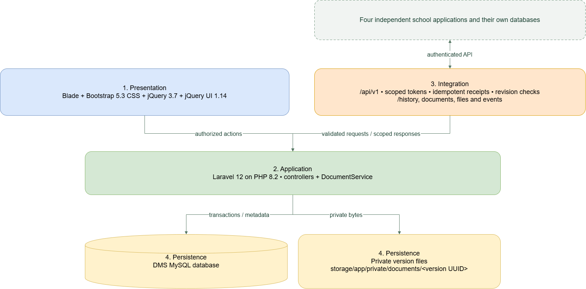

# Approved proposed architecture

Reference accepted 10 October 2026. Read [MASTERPLAN.md](../MASTERPLAN.md) for scope, status, phases, backlog and production gates; [AGENTS.md](../AGENTS.md) defines implementation rules.

`ARCHITECTURE.png` is the user-supplied final visual reference. `ARCHITECTURE.drawio` and `ARCHITECTURE.xml` contain its visible system-context page extracted from editable PNG metadata. The PNG also embeds older detailed pages; those pages are not adopted as new requirements. Prior diagrams remain under `archive/`. Original Downloads files are unchanged.

## Four logical responsibilities

| Tier | Responsibility | Implementation |
|---|---|---|
| 1. Presentation | School-user pages, navigation, forms and interactions | Blade, Bootstrap 5.3 CSS, jQuery 3.7, jQuery UI 1.14 |
| 2. Application | Authorized actions, validation, document rules and transactions | Laravel 12 on PHP 8.2; controllers and DocumentService |
| 3. Integration | Authenticated source input and scoped output | /api/v1; scoped tokens, idempotent receipts, revision checks; history/documents/files/events |
| 4. Persistence | DMS metadata/history and private version bytes | MySQL/InnoDB plus storage/app/private/documents/<version UUID> |

Presentation and integration both enter application logic. The application accesses DMS persistence. This is one Laravel deployment, not four servers or microservices. Eloquent handles user identity; other persistence predominantly uses Laravel's query builder. MVC with a service is not a completed, fully isolated Clean Architecture implementation.

## Five independent systems

Employee Management, Online Admission, DMS, Enrollment and Payroll Management each own their operational database. The four external applications connect through authenticated APIs, never direct DMS table writes. Central history lives in DMS, not a sixth shared database. Sources retain business authority.

DMS stores agreed snapshots and received history. Entering an API URL does not supply schemas, stable identities, revisions, a consistent export cursor or durable delivery. Initial import, adapters/outboxes and reconciliation require coordinated contracts.

## Current behavior and invariants

- No DMS approval/rejection or verification of admission, enrollment, employment or payroll decisions.
- Scanning is removed by explicit user decision, reconfirmed 10 October 2026. Obsolete ClamAV/blocked-scan labels in historical material are superseded.
- Supported extension, actual MIME/signature, nonempty content and size remain validated. Authorized valid uploads are immediately available; retrieval verifies checksums.
- Database transactions cover metadata, audit and outgoing events. Private disk writes need cleanup on failure; database transactions do not make disk writes atomic.
- Personal files/folders are owner-scoped; offices are source-scoped; all roles are school/campus scoped. Named shares are expiring, revocable and pinned to one version.
- Filename/title keys enforce case-insensitive owner-workspace uniqueness across folders and Trash. New versions preserve older content; concurrent edits require revision checks.
- History uses scoped record keys, complete snapshots, canonical replay hashes, unique event/revision identities and record locks. Older revisions cannot regress current snapshots; deletes create tombstones.
- Audit is application append-only, not an externally tamper-proof ledger. Received history does not prove source delivery completeness.

## Production boundary

Implemented: document/version intake, private access, Drive organization, audience grants/comments, local RBAC/accounts, received source history and cursor feeds. See the master plan for verified status and remaining tasks.

MySQL is the deployment target. Local preview remains SQLite; MariaDB is not represented as MySQL. Use isolated test databases. CI configuration and SQLite success do not establish real multi-writer behavior.

Remaining: source contracts/schema grants, identity mapping, reliable import/reconciliation, MySQL concurrency/migration checks, school-approved retention/holds/disposal, HTTPS/secrets, monitoring, consistent database/file recovery, and a visually verified user pilot. Serve only public/; never expose private document storage.
