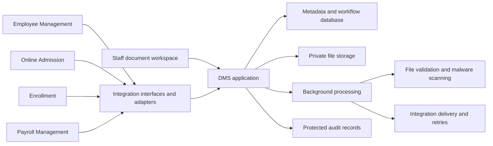

> Historical proposal. Current architecture and workflow ownership supersede conflicting assumptions, including mandatory DMS business review. See ARCHITECTURE.md and WORKFLOW-OWNERSHIP.md.

# School Document Management System — Build Plan and Product Backlog

## 1. Purpose

Build a centralized Document Management System that securely manages school documents and integrates with:

1. Employee Management System
2. Online Admission System
3. Enrollment System
4. Payroll Management System

The DMS must work with these existing systems and provide a reusable integration foundation for a future school ERP.

The intended outcome is that authorized users can find, submit, verify, and use the correct documents without repeatedly uploading files or maintaining disconnected copies.

## 2. Planning assumptions

These assumptions should be validated during discovery:

- The four connected systems remain operational.
- Each system can eventually exchange data through an API, supported export/import, or integration adapter.
- Applicant, student, and employee identifiers may differ between systems.
- School staff are the initial primary users.
- Applicants and employees submit or retrieve documents through their existing portals where possible.
- The DMS supports school and campus boundaries, even if the initial deployment serves one school.
- Existing document volumes, hosting requirements, and applicable retention obligations are not yet known.

“Integration-ready” means that contracts, identifiers, security rules, and failure handling are implemented and tested. A production connection also depends on the capabilities and access provided by the external system.

## 3. Scope and ownership

| System | Owns | DMS responsibility |
|---|---|---|
| Employee Management | Employee identity, department, position, employment status | Employee documents, versions, access and expiry tracking |
| Online Admission | Applicant identity, applications, admission decisions | Submitted evidence, document requirements and verification records |
| Enrollment | Student identity, enrollment records, enrollment decisions | Enrollment evidence and access to linked admission documents |
| Payroll Management | Payroll calculations, pay runs and payment results | Payslip files and restricted supporting documents |
| DMS | Document records and lifecycle | Storage, metadata, versions, document verification, access, audit and retention |

### Ownership rules

- An approved document does not automatically mean an approved application or enrollment.
- Payroll calculates payslips; the DMS stores and delivers the resulting files.
- Employee Management determines employment status; the DMS responds to that status according to configured access and retention rules.
- Document verification belongs to the DMS baseline. Connected systems display or consume its result.
- Each integration must have one agreed owner for every synchronized field.
- Deleting a business record in another system must not automatically destroy retained documents.

## 4. Initial document categories

| Area | Example documents | Initial handling |
|---|---|---|
| Admission | Identity evidence, previous academic records, application attachments | Link to applicant and application; verify against admission requirements |
| Enrollment | Enrollment forms, consent forms, supporting certificates | Link to student and enrollment period; reuse eligible admission evidence |
| Employee | Contracts, qualifications, certifications | Link to employee; restrict sensitive categories; track relevant expiry dates |
| Payroll | Payslips, payroll authorizations, supporting attachments | Link to employee and pay run; enforce separate payroll permissions |
| School administration | Policies, procedures, official forms | Publish approved versions to authorized audiences |

The school must approve the final document catalogue, required metadata, permitted file types, and access classifications before implementation.

## 5. Proposed architecture baseline

Start with one deployable application containing clearly separated modules. The integration boundary should allow modules or connectors to be separated later if operational needs justify it.

### Core modules

| Module | Responsibility |
|---|---|
| Identity and permissions | Authentication, roles, school/campus scope and document restrictions |
| Document catalogue | Categories, required fields, classifications and requirement rules |
| Document repository | File ingestion, versions, secure retrieval and document links |
| Verification workflow | Submission, review, approval, rejection and replacement |
| Search and reporting | Authorized search, missing documents and expiry reporting |
| Integration | External identifiers, APIs, events, imports and reconciliation |
| Records lifecycle | Archiving, retention, holds and controlled disposal |
| Operations | Monitoring, backups, recovery and support tools |

### File security baseline

Use private storage, permitted file types, file-size limits, content validation and malware scanning. Uploaded files remain unavailable to ordinary users until security checks pass. These controls follow the principles in the [OWASP File Upload Cheat Sheet](https://cheatsheetseries.owasp.org/cheatsheets/File_Upload_Cheat_Sheet.html).

Search results, previews, exports and integrations must enforce the same permissions as direct document access.

## 6. Core information model

| Entity | Purpose |
|---|---|
| Organization / Campus | Establishes the school and campus scope |
| Subject | Represents an applicant, student or employee within the DMS |
| External Identity Link | Maps a subject to identifiers in connected systems |
| Business Record Link | Links documents to an application, enrollment, employee record or pay run |
| Document | Stores stable document identity, category, classification and ownership |
| Document Version | Stores immutable file reference, checksum, size, media type and upload details |
| Document Link | Allows the same document to support multiple authorized business records |
| Requirement Definition | Describes a required document and the rules for satisfying it |
| Requirement Instance | Tracks a requirement for a particular application, enrollment or employee |
| Verification Record | Records the reviewer, decision, reason and exact version reviewed |
| Access Grant | Records exceptional, scoped and time-limited access |
| Retention Policy / Hold | Controls preservation and disposal eligibility |
| Audit Event | Records document and administrative actions |
| Integration Delivery | Tracks event delivery, retries and reconciliation |

### Minimum document metadata

- Document ID and version ID
- School and applicable campus
- Category and title
- Subject ID and business-record links
- Source system and external reference
- Security classification
- Uploaded by and uploaded at
- File type, size and checksum
- Security scan status
- Verification status
- Issue date and expiry date where relevant
- Applicable retention policy

Avoid collecting additional personal information unless it has a defined operational purpose.

### Separate lifecycle states

Keep these states separate so one status does not carry several meanings:

| Dimension | Example states |
|---|---|
| File security | Pending scan, clean, quarantined, failed |
| Verification | Draft, submitted, under review, approved, rejected |
| Records lifecycle | Active, archived, disposal pending, disposed |
| Validity | Current, expired, superseded |

Approval applies to a specific version. Uploading a replacement creates a new version requiring review when the category requires verification.

## 7. Integration contracts

### Common contract requirements

Every connected system should use:

- Stable DMS document and version identifiers
- Source-system identifiers and school scope
- Scoped service credentials
- Versioned interface contracts
- Idempotency keys for repeatable submissions
- Correlation identifiers for troubleshooting
- Defined error codes and validation messages
- Paginated queries and incremental synchronization
- Reliable event delivery with retry and replay
- Reconciliation reports for missed or inconsistent records

A permanent file-storage URL must not act as authorization. Downloads must pass an access check or use a short-lived, narrowly scoped download mechanism.

### System-specific exchanges

| Connected system | Sends to DMS | Receives from DMS |
|---|---|---|
| Employee Management | Employee references, relevant status changes, document context | Document lists, verification outcomes, missing or expiring requirements |
| Online Admission | Applicant/application references, document submissions, applicable requirements | Submission receipts, verification outcomes, completeness status |
| Enrollment | Student/enrollment references, confirmed applicant-to-student mapping | Linked admission evidence, enrollment document status |
| Payroll Management | Employee/pay-run references, generated payslips, supporting files | Storage receipts, authorized retrieval and processing outcomes |

### Initial event types

- Document received
- File security check completed
- Document submitted for review
- Document approved
- Document rejected
- Document version added
- Document nearing expiry
- Document archived
- Document disposed
- Requirement completeness changed

Events should contain the minimum necessary references and status data. Consumers retrieve sensitive details through an authorized interface.

### Reliability rules

- Save a business change and its pending integration event atomically.
- Assume an event may arrive more than once.
- Prevent duplicate processing through event identifiers and idempotency controls.
- Include document/version sequencing so older events cannot overwrite newer state.
- Retry temporary failures; surface persistent failures for support action.
- Keep accepted document operations durable when another system is temporarily unavailable.
- Reconcile periodically rather than relying only on notifications.

## 8. Build phases

Indicative effort ranges below assume a dedicated delivery team and reasonably accessible connected systems. They are planning estimates, not a committed schedule.

| Phase | Indicative duration | Main deliverables | Exit gate |
|---|---:|---|---|
| 0. Discovery and contracts | 2–3 weeks | Document catalogue, ownership matrix, access matrix, integration assessment, volume estimates, retention decisions | Stakeholders approve scope and ownership; external interfaces are understood |
| 1. Secure foundation | 3–4 weeks | Authentication, permissions, metadata, private storage, scanning, audit, versioning | Authorized upload/retrieval works; unauthorized access and unsafe files are blocked |
| 2. Document workflows | 3–4 weeks | Requirements, review queues, approval/rejection, search, missing-document reports | End-to-end document workflow passes business acceptance |
| 3. Admission and enrollment | 3–5 weeks | First live connectors, applicant/student mapping, document reuse, retries and reconciliation | Application-to-enrollment flow works without duplicate uploads |
| 4. Employee and payroll | 3–4 weeks | Employee connector, payslip ingestion/retrieval, expiry reporting, payroll restrictions | Correct employee receives correct payslip; cross-user access is denied |
| 5. Migration and rollout | 2–3 weeks | Legacy import, retention controls, recovery validation, training and phased deployment | Migration reconciles; security, recovery and operational gates pass |

Some activities can overlap. Re-estimate after discovery, particularly if existing systems lack usable integration interfaces.

### Recommended rollout sequence

1. Staff repository and document verification
2. Admission submission and review
3. Enrollment reuse and requirement checking
4. Employee documents
5. Payroll documents
6. Additional publishing and automation features

Select a limited school/campus or business group for the pilot before expanding access.

## 9. Proposed release boundaries

### R1 — Operational baseline

Secure repository, verification, required-document tracking, all four integration paths, audit, migration, retention controls, monitoring and recovery.

An R1 capability can be built earlier and piloted before the complete release is ready.

### R2 — Enhancements

School policy publishing, acknowledgments and exception-sharing features.

### Deferred unless separately approved

- OCR and automated classification
- AI-based document decisions
- Electronic signature services
- A general-purpose workflow designer
- Replacing the four existing systems
- Payroll calculation
- Full ERP implementation
- A separate applicant or employee portal when an existing portal can provide the experience

## 10. Product backlog — 45 user stories

Acceptance criteria below are minimum test conditions. Tests must cover both permitted actions and denial cases using representative school data.

### A. Identity, scope and configuration

| ID | Release | User story | Acceptance criteria |
|---|---|---|---|
| US-01 | R1 | As a staff member, I want to sign in through the school identity service so that I can use my existing account. | An active mapped account can sign in; an unmapped or disabled account is denied; no document becomes accessible before authorization is evaluated. |
| US-02 | R1 | As an administrator, I want role-based permissions so that staff receive appropriate capabilities. | Upload, review, download, export and administration permissions can be assigned separately; prohibited actions are denied through both the interface and API; permission changes are audited. |
| US-03 | R1 | As a school administrator, I want school and campus access boundaries so that records are visible only within approved scopes. | A user cannot search, preview or retrieve documents outside assigned scopes; changing a document ID cannot bypass the boundary; authorized cross-campus access works only within the same approved school scope. |
| US-04 | R1 | As a records officer, I want document categories and required fields so that documents are classified consistently. | An administrator can configure category fields and permitted formats; missing required values prevent submission; retiring a category preserves existing records and their metadata. |
| US-05 | R1 | As a privacy officer, I want sensitivity classifications so that restricted records receive appropriate protection. | Every category has a default classification; only authorized roles can change it; restricted documents are excluded from unauthorized search results, counts, previews and exports. |

### B. Document intake and repository

| ID | Release | User story | Acceptance criteria |
|---|---|---|---|
| US-06 | R1 | As an authorized user, I want to upload a document so that it is recorded against the correct person and business record. | A valid upload creates document/version IDs and source references; invalid or unauthorized references are rejected; a receipt is returned only after the upload is durably recorded. |
| US-07 | R1 | As a security administrator, I want uploads validated and scanned so that unsafe files are isolated. | Disallowed type or size is rejected; pending files cannot be ordinarily previewed or downloaded; a failed or malicious scan quarantines the file; a clean result enables permitted access. |
| US-08 | R1 | As a records officer, I want document metadata validated so that records remain reliable. | Required fields and configured date rules are enforced; metadata edits preserve previous values in audit history; linked business records must exist within the permitted school scope. |
| US-09 | R1 | As a staff member, I want potential duplicate uploads identified so that I can avoid unnecessary copies. | Matching checksums within an authorized context trigger a warning; the user can reuse an eligible document or proceed with a reason; warnings never reveal documents the user cannot access. |
| US-10 | R1 | As an authorized reader, I want a safe preview so that I can inspect documents before downloading. | Supported clean files display a preview; unsupported formats show a clear message; preview requests enforce document permissions; the preview identifies the displayed version. |
| US-11 | R1 | As an authorized reader, I want to download the correct version so that I can use an accurate copy. | The selected version is returned after an access check; tampered, expired or unauthorized download requests fail; the download records the actor and version in the audit trail. |
| US-12 | R1 | As a document owner, I want version history so that replacements do not erase evidence. | A replacement creates an immutable new version; prior versions remain available to permitted users; approval of an earlier version does not approve its replacement; concurrent updates cannot silently overwrite each other. |
| US-13 | R1 | As a records officer, I want one document linked to multiple relevant records so that approved evidence can be reused. | Additional links do not duplicate file storage; each link requires permission and valid context; adding a link does not automatically broaden access; removing a link preserves other links and the document. |

### C. Requirements and verification

| ID | Release | User story | Acceptance criteria |
|---|---|---|---|
| US-14 | R1 | As a process administrator, I want configurable document requirements so that each process requests the correct evidence. | Requirements can vary by process and configured attributes; mandatory and optional requirements are distinguishable; changing a rule does not silently alter already-created requirement instances. |
| US-15 | R1 | As a submitter, I want to submit documents for review so that reviewers can verify my evidence. | Submission requires completed metadata and a clean security result; the submitted version enters the appropriate queue; unauthorized or incomplete submissions are rejected with an actionable reason. |
| US-16 | R1 | As a reviewer, I want an assigned review queue so that I can process documents within my responsibility. | Only permitted submissions appear; the queue supports category and status filters; assignment or concurrency controls prevent two conflicting decisions from both succeeding. |
| US-17 | R1 | As a reviewer, I want to approve a document so that its verified status can support school processes. | Approval records reviewer, time and exact version; configured separation-of-duty rules are enforced; the requirement status is recalculated; a corresponding integration event is recorded. |
| US-18 | R1 | As a reviewer, I want to reject a document with a reason so that the submitter knows what to correct. | A rejection reason is mandatory; rejection and permitted feedback are visible through the originating process; replacement submission preserves the earlier decision and starts a new review. |
| US-19 | R1 | As a process officer, I want document completeness calculated so that I can identify outstanding requirements. | Required approved/current evidence satisfies the relevant requirement; rejected, expired or unapproved evidence does not; optional requirements do not block completeness; authorized waivers are recorded with reason and actor. |
| US-20 | R1 | As a records officer, I want expiry tracking so that outdated evidence is identified. | Relevant categories support expiry dates; configured thresholds generate one reminder per threshold/version; expired evidence updates requirement status; a current replacement stops obsolete reminders. |

### D. Search, reporting and communications

| ID | Release | User story | Acceptance criteria |
|---|---|---|---|
| US-21 | R1 | As a staff member, I want to search document metadata so that I can locate records quickly. | Search supports authorized subject/reference and title queries; category, date and status filters work together; results and totals omit unauthorized records. |
| US-22 | R1 | As a process manager, I want missing-document reports so that I can follow up on incomplete records. | Reports distinguish missing, rejected, expired and pending evidence; filters support process and applicable period; results reconcile with individual requirement records. |
| US-23 | R1 | As a manager, I want workflow dashboards so that I can see review workload. | Counts show pending and overdue reviews within the viewer’s scope; selecting a count opens matching records; the refresh timestamp is displayed; restricted records do not leak through totals. |
| US-24 | R1 | As a user, I want relevant notifications so that I can act on document changes. | Submission outcomes, review outcomes and expiry events reach the configured channel or originating system; duplicate events do not create duplicate notifications; messages avoid sensitive content and use access-controlled links. |
| US-25 | R1 | As an authorized officer, I want to export document reports so that I can support school reporting. | Export uses the same filters and access rules as the displayed report; exported columns follow permissions; the export is audited; temporary export files expire according to configuration. |

### E. School administration documents

| ID | Release | User story | Acceptance criteria |
|---|---|---|---|
| US-26 | R2 | As a policy owner, I want to publish approved school documents so that staff can access the current version. | Only authorized publishers can publish; the audience and effective date are recorded; the current publication is distinguishable from superseded versions; earlier versions remain retained according to policy. |
| US-27 | R2 | As a policy owner, I want acknowledgments so that I can track who has read a required document. | Acknowledgment records user, time and exact version; an updated version can require a new acknowledgment; reports distinguish acknowledged and outstanding users within authorized scope. |

### F. Integration foundation

| ID | Release | User story | Acceptance criteria |
|---|---|---|---|
| US-28 | R1 | As an integration administrator, I want scoped service accounts so that systems access only permitted documents and actions. | Each connector has separately identifiable credentials and scopes; forbidden actions and cross-school requests fail; credentials can be rotated or revoked; connector actions identify the service account in audit records. |
| US-29 | R1 | As an integration developer, I want documented interfaces so that connected systems can submit and retrieve documents consistently. | Versioned contracts cover submission, metadata, status and authorized retrieval; validation errors are structured; queries are paginated; automated contract tests run against a reference client. |
| US-30 | R1 | As an integration developer, I want repeatable submissions so that retries do not create duplicate records. | Repeating an operation with the same idempotency key and payload returns the original result; reusing the key with a different payload returns a conflict; the agreed key-retention window is documented and tested. |
| US-31 | R1 | As an integration administrator, I want external identity mappings so that documents remain attached to the right person. | Mapping uses source system, external ID and school scope; names alone never create a match; ambiguous mappings enter an exception queue; approved mapping changes preserve audit history and document ownership. |
| US-32 | R1 | As a connected system, I want document events so that I can reflect current status. | Events have unique IDs, schema versions, document/version references and sequencing data; delivery uses an authenticated destination; a failed delivery does not roll back the accepted document change. |
| US-33 | R1 | As a support officer, I want retry and replay controls so that interrupted integrations can recover. | Temporary failures retry according to configuration; exhausted deliveries appear in a support queue; authorized replay is audited; repeated or older events cannot duplicate records or regress current status. |
| US-34 | R1 | As an integration administrator, I want reconciliation reports so that missed exchanges are detected. | Reconciliation identifies missing references, stale statuses and failed transfers; a simulated outage followed by recovery is reconciled successfully; corrections are logged and unresolved exceptions remain visible. |

### G. Integrations with existing systems

| ID | Release | User story | Acceptance criteria |
|---|---|---|---|
| US-35 | R1 | As an admission officer, I want applicant submissions connected to the DMS so that admission evidence can be reviewed centrally. | A portal submission links to the correct applicant/application; the originating system receives a receipt and current verification outcome; integration failure is visible and cannot appear as successful submission. |
| US-36 | R1 | As an enrollment officer, I want accepted admission evidence reused so that students do not submit the same document again. | A confirmed applicant-to-student mapping enables eligible document links; reuse retains the original file/version and review history; expired or unsuitable evidence is flagged; ambiguous mapping blocks automatic reuse. |
| US-37 | R1 | As an HR officer, I want employee documents linked to Employee Management so that staff records remain consistent. | Valid employee references link documents to the correct employee; relevant employment updates are consumed; inactive employment changes access according to policy while preserving retained documents; unmatched records enter an exception queue. |
| US-38 | R1 | As a payroll officer, I want generated payslips stored in the DMS so that each employee can retrieve the correct record. | Payslips link to employee and pay run; retries do not create duplicates; an employee can retrieve only their own permitted payslips; corrected payslips preserve prior versions and clearly identify the current one. |

### H. Governance and records lifecycle

| ID | Release | User story | Acceptance criteria |
|---|---|---|---|
| US-39 | R1 | As an auditor, I want protected audit history so that document actions can be traced. | Uploads, reads, downloads, decisions, permission changes and disposal actions record actor, time, target and outcome; ordinary users and administrators cannot edit history through application functions; audit access itself is restricted. |
| US-40 | R1 | As a records officer, I want retention rules and holds so that records remain preserved for the required period. | Retention uses configured category and trigger dates; a hold prevents disposal even when retention has elapsed; hold creation/release requires permission and is audited; unconfigured retention routes to review rather than automatic disposal. |
| US-41 | R1 | As a records officer, I want controlled archival and disposal so that obsolete records are handled consistently. | Archival preserves permitted retrieval; disposal requires eligibility checks and configured approval; any active hold blocks disposal; files and derived copies are removed from active stores and a minimal disposal record is retained; backup treatment follows the approved recovery/retention policy. |
| US-42 | R2 | As a records officer, I want time-limited exception sharing so that an authorized recipient can access a specific document. | Grants identify recipient, document/version, permitted action and expiry; anonymous access is disabled; expired or revoked grants fail; granting and using access are audited. |

### I. Migration and operations

| ID | Release | User story | Acceptance criteria |
|---|---|---|---|
| US-43 | R1 | As a migration administrator, I want legacy documents imported so that existing records are preserved. | Import validates and scans files; metadata and links are mapped before publication; source/import counts and checksums reconcile; exceptions are reported; rerunning the same batch does not duplicate successful records. |
| US-44 | R1 | As an operations administrator, I want tested backup and recovery so that document services can recover from failure. | Backups cover files, metadata, identity links and necessary keys/configuration; an isolated restore meets agreed recovery targets; restored files match checksums and permissions; event recovery does not create uncontrolled duplicate deliveries. |
| US-45 | R1 | As an operations administrator, I want monitoring and actionable alerts so that failures are detected promptly. | Monitoring covers availability, storage, scanning, processing queues and connectors; injected failures trigger alerts within the agreed threshold; alerts include a correlation reference and support owner; dashboards do not expose sensitive document contents. |

## 11. Cross-cutting release acceptance criteria

These criteria apply to every relevant user story.

| Area | Release gate |
|---|---|
| Authorization | Tests confirm permitted access and deny cross-user, cross-role and cross-school access through UI, API, preview, search and export |
| Confidentiality | Files and sensitive metadata use approved encryption in transit and at rest; credentials and keys are access-controlled |
| File security | Unsafe files remain isolated; scanner failure cannot silently enable access |
| Integrity | Version history, checksums and concurrent-update handling preserve the correct evidence |
| Integration | Duplicate submissions, repeated events, out-of-order events and external outages are tested |
| Privacy | Notifications, logs and events contain only the personal data required for their purpose |
| Accessibility | Critical upload, review, search and retrieval journeys work with keyboard navigation, clear labels and accessible validation feedback |
| Recovery | A complete recovery drill succeeds against stakeholder-approved recovery targets |
| Migration | Imported counts, associations and checksums reconcile; unresolved exceptions have named owners |
| Operations | Support runbooks cover quarantined files, failed integrations, mistaken links and recovery |

### Proposed performance targets

Treat these as starting targets to validate against document volumes, hosting and school usage:

- Metadata search: 95% of requests complete within 2 seconds at agreed peak load.
- Metadata/status APIs: 95% complete within 1 second, excluding file transfer and asynchronous processing.
- Successful status changes: 95% reach an available connector within 60 seconds.
- Availability: initial target of 99.9% per month, with measurement and maintenance treatment agreed.
- Recovery point: initial target of no more than 1 hour of data loss.
- Recovery time: initial target of restoration within 4 hours.

Discovery must define maximum file size, expected concurrent users, daily upload volume, total storage growth and scanning turnaround before these targets become commitments.

## 12. Decisions required during discovery

| Decision | Why it matters |
|---|---|
| Existing APIs, exports and vendor access | Determines how each connector can be built |
| Identity provider and user roles | Determines authentication and access design |
| One school or multiple schools/campuses | Determines isolation and administration scope |
| Applicant-to-student identity mapping | Prevents documents being attached to the wrong person |
| Payroll document access rules | Protects sensitive employee information |
| Final document catalogue and requirement rules | Determines workflows and validation |
| Retention, holds and disposal requirements | Determines lifecycle configuration |
| Hosting, storage location and recovery targets | Determines deployment and operating cost |
| Legacy document volume and quality | Determines migration effort |
| Pilot group and acceptance owners | Determines rollout and sign-off |

## 13. Definition of success

The baseline is ready for rollout when:

1. Each connected system can submit or retrieve its permitted documents through an agreed integration.
2. Applicant documents can follow a confirmed identity into enrollment without unnecessary duplication.
3. Verification outcomes remain tied to the exact document version reviewed.
4. Users can access only the documents permitted by their role, school scope and relationship to the record.
5. Retries and outages do not lose accepted documents or create duplicate business records.
6. Audit, retention, migration and recovery controls pass their release gates.
7. School process owners approve the pilot results and operations staff can support the service.